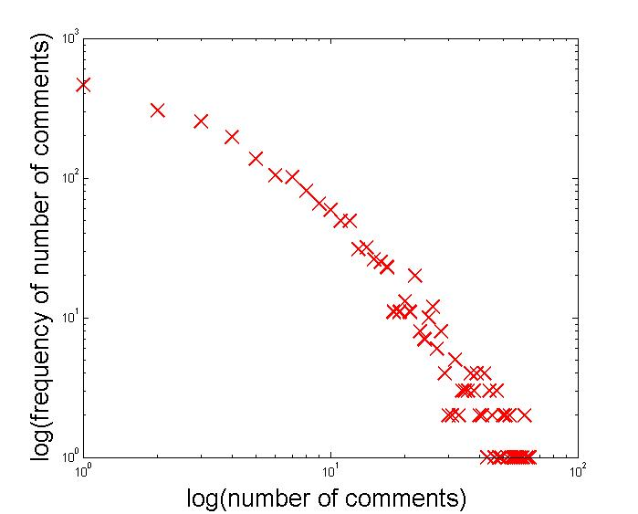

#Project: Summarize reviews of professors on ratemyprofessor.com
###Team members
* Andrew Han
* Meng Sun
* Wenqiang Wang

###Data description
All the ratings of professors at USC in json format.

**_usc.prof.ratings.json_**

number of professors: _2191_

####fields in each data item
|**_fields_**|**_description_**    |
|------------|---------------------|
|pid         |the id of a professor|
|last_name   |the last name        |
|first_name  |the first name       |
|ratings     |content              |

####fields in _ratings_
|**_fields_**     |**_description_**    |
|-----------------|---------------------|
|rComments        |what we want         |
|attendance       |is attendace required|
|clarityColor     |                     |
|easyColor        |                     |
|helpColor        |                     |
|helpCount        |                     |
|id               |the id of this rating|
|notHelpCount     |                     |
|onlineClass      |                     |
|quality          |                     |
|rClarity         |                     |
|rClass           |class code at USC    |
|rDate            |submit date          |
|rEasy            |                     |
|rErrorMsg        |                     |
|rHelpful         |                     |
|rInterest        |a tag                |
|rStatus          |                     |
|rTextBookUse     |                     |
|sId              |school(university) id|
|takenForCredit   |                     |
|teacher          |                     |
|teacherGrade     |                     |
|teacherRatingTags|tags                 |
|unUsefulGrouping |                     |
|usefulGrouping   |                     |

####Distribution of the number of comments of each professor
It is power-law...

|**_Mean_**|**_Median_**|**_Max._**|**_Min._**|
|----------|------------|----------|----------|
|7.1       |4           |172       |1         |

**_usc.prof.comments_**

####format

[pid]\t[first name]\t[last name]\t[#comments]

[comment1]

[comment2]

...

[pid]\t[first name]\t[last name]\t[#comments]

...